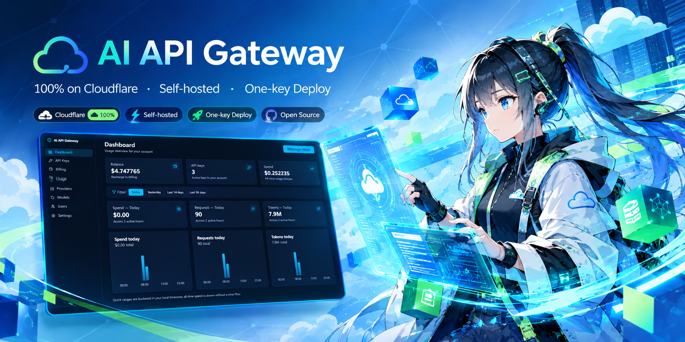

# AI API Gateway



[](https://github.com/limccn/cf-ai-gateway/actions/workflows/ci.yml)
[](LICENSE)

**中文 | [English](README.en.md)**

**自托管的 OpenAI 兼容 AI API 网关——一个入口代理多家模型供应商，100% 运行在 Cloudflare 上，无需任何外部服务。**

## 这是什么

把多家模型供应商（OpenAI 兼容接口与 Anthropic 原生格式）收敛成一个统一入口：你的应用照常用官方 SDK，只把 base URL 指向网关。网关负责用自己签发的 API Key 做鉴权、预付费按量计费、限流与缓存，并提供网页管理台看用量、管密钥、成员和模型价格。

## 能给谁用 / 能做什么

适合想统一管理多家模型供应商的个人与团队——尤其是把现有 OpenAI / Anthropic 应用迁到自托管入口、或需要给成员分发限额密钥并按量计费的场景：

- 一个入口多家模型（OpenAI 兼容 + Anthropic 原生格式）
- 应用侧几乎零改动：SDK 只换 base URL，换模型只改 `model` 参数
- 团队密钥：给每人发 key，可单独限速、随时吊销
- 预付费余额、按 token 计费，请求失败不扣费
- 自带限流与响应缓存：超额自动拒绝，重复请求更快更省
- 网页管理台：看用量报表，管密钥、成员与模型价格
- 数据与密钥留在自己的 Cloudflare 账号里（自托管）

## 快速开始

把自己的实例部署到 Cloudflare，三步：

1. **克隆并安装**：`git clone <your-repo-url> cf-ai-gateway && cd cf-ai-gateway && npm install`
2. **配置环境变量**：`cp .dev.vars.example .dev.vars`，按下节说明填入必需值
3. **发布**：`npm run deploy`（自动完成构建、渲染配置与 `wrangler deploy --config wrangler.toml`）

> 首次部署前还需在 Cloudflare 创建 D1 / KV / Queue 资源、应用数据库迁移、写入 secrets 并设置首个管理员——完整从零清单见 [CLAUDE.md](CLAUDE.md) §部署要点。

### 必需的环境变量与配置

所有配置集中在 `.dev.vars`（由 `.dev.vars.example` 复制而来；该文件已 gitignore，**不要提交**）。按性质分三类：

**① 基础设施标识**（没有缺省值，任一缺失即渲染失败）——在 Cloudflare 创建资源后填入：

| 键 | 说明 |
| --- | --- |
| `WORKER_NAME` | Worker 名（资源统一按 `<worker>-<purpose>` 命名） |
| `DOMAIN` / `API_DOMAIN` / `LEGACY_DOMAIN` | 平台访问域 / 公开 API 域 / 旧域转发源 |
| `D1_DB_NAME` / `D1_DB_ID` | D1 数据库名 / id |
| `KV_ID` | KV 命名空间 id |
| `QUEUE_NAME` / `BILLING_QUEUE_NAME` | 用量聚合 / 计费队列名 |

**② 运行时值**（渲染进 `wrangler.toml` 的 `[vars]`）：

| 键 | 说明 |
| --- | --- |
| `BETTER_AUTH_URL` | 平台域完整地址（如 `https://platform.example.com`）——**必填**；缺失会导致管理后台被重定向到 localhost |
| `GITHUB_CLIENT_ID` / `GITHUB_ALLOWED_EMAILS` | 可选，启用 GitHub 登录才需要填值（回调地址必须等于 `https://<your-domain>/api/auth/callback/github`；邮箱白名单为空 = 拒绝所有登录） |
| `API_KEY_PREFIX` / `REQUEST_LOG_RETENTION_DAYS` | 网关密钥前缀（缺省 `sk-`）/ 请求日志保留天数 |
| `CACHE_ENABLED`、`EMAIL_VERIFICATION_ENABLED` 等策略开关 | 全部有安全缺省（缺省即关闭），可留空、按需开启 |

**③ 真实 secrets**（**绝不写入文件或仓库**，部署侧用 `wrangler secret put` 逐个写入）：

- `BETTER_AUTH_SECRET`、`GATEWAY_SECRET_KEY`——均必需（后者用于加密上游供应商密钥；各自随机生成，两者不得相同）
- `GITHUB_CLIENT_SECRET`——仅启用 GitHub 登录时需要

各键的权威注释见 `.dev.vars.example`；完整三分类规则与全量键清单见 [CLAUDE.md](CLAUDE.md) §环境与配置。

## 接入示例

官方 SDK 只需换两处：base URL 指向网关，Key 用网关里创建的密钥：

```ts
import OpenAI from "openai";

const openai = new OpenAI({
  apiKey: "sk-…",                          // gateway API key
  baseURL: "https://<gateway>/v1",         // only this line changes
});

const completion = await openai.chat.completions.create({
  model: "gpt-…",                          // any model configured in the gateway
  messages: [{ role: "user", content: "hi" }],
});
```

```ts
import Anthropic from "@anthropic-ai/sdk";

const anthropic = new Anthropic({
  apiKey: "sk-…",                          // gateway API key
  baseURL: "https://<gateway>/anthropic",  // only this line changes
});

const message = await anthropic.messages.create({
  model: "claude-…",                       // any model configured in the gateway
  max_tokens: 1024,
  messages: [{ role: "user", content: "hi" }],
});
```

两种鉴权头（`Authorization: Bearer` 与 Anthropic 原生的 `x-api-key`）网关都接受。完整协议与端点见 [CLAUDE.md](CLAUDE.md)。

## 本地运行

**要求**：Node.js ≥ 20 和 npm；本地开发无需 Cloudflare 账号。

四步启动：

```bash
git clone <your-repo-url> cf-ai-gateway
cd cf-ai-gateway
npm install

# 1. Create local config from the committed template (gitignored)
cp .dev.vars.example .dev.vars   # fill in local values — see CLAUDE.md §环境与配置

# 2. Render wrangler.toml (generated file, never edit by hand)
npm run render:config

# 3. Prepare the local database
npm run db:migrate     # apply migrations
npm run db:seed        # seed the default model price table (idempotent)

# 4. Start the dev server
npm run dev            # http://localhost:5173
```

`npm run dev` 需要 `.dev.vars` 存在才能启动；GitHub OAuth 是可选项，不配置也能跑。

**第一个账号怎么来**：邮箱密码注册需要邀请码，而第一个管理员还没有发码入口——本地二选一：

- **种子账号（推荐，最快）**：在 `.dev.vars` 设置 `SEED_USERS`（格式见 `.dev.vars.example` 内注释，仅限本地使用），保持 `npm run dev` 运行，另开终端执行 `npm run seed:users`——直接创建含管理员的测试账号。
- **GitHub OAuth**：配好 `.dev.vars` 里的 GitHub 应用凭据与邮箱白名单，登录后把自己提升为管理员：

  ```bash
  npx wrangler d1 execute cf-ai-gateway-db --local \
    --command "UPDATE users SET role='admin' WHERE email='you@example.com';"
  ```

管理员登录后即可在管理台生成邀请链接，成员打开链接用邮箱密码注册即可。

## 自部署与技术文档

- **部署要点**（两环境命令、`--config` 警告、从零建站清单）→ [CLAUDE.md](CLAUDE.md) §部署要点
- **API 参考 / 常用命令 / 测试与验收 / 项目结构** → [CLAUDE.md](CLAUDE.md)

线上环境：staging `https://stg-platform.lmlh.net`（公开 API `https://stg-api.lmlh.net`）、生产 `https://platform.lmlh.net`（公开 API `https://api.lmlh.net`），旧域名保留为转发源。

## 许可

MIT，见 [LICENSE](LICENSE)。
